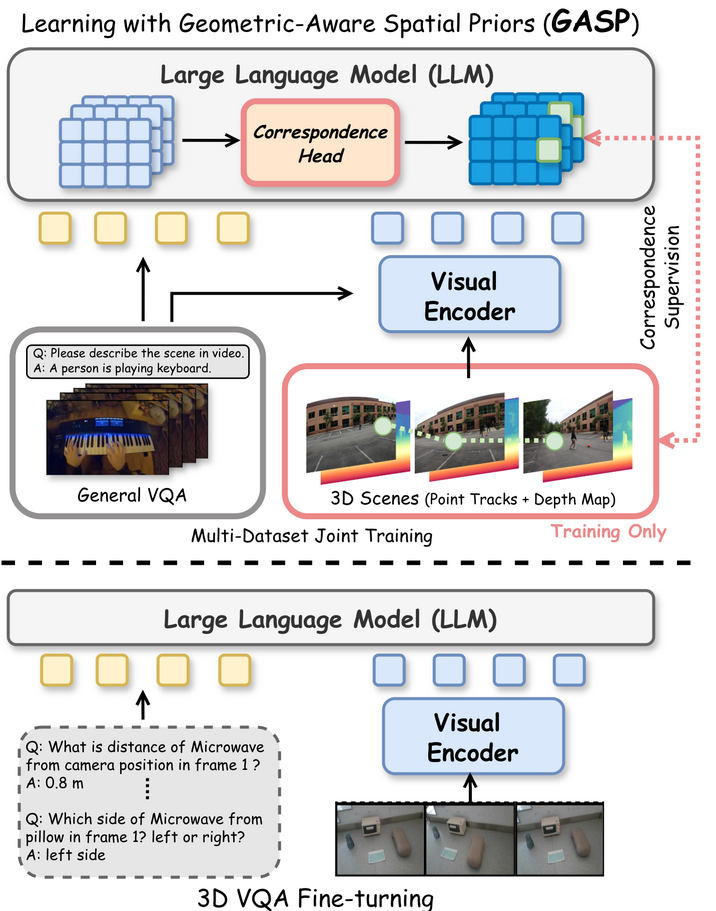
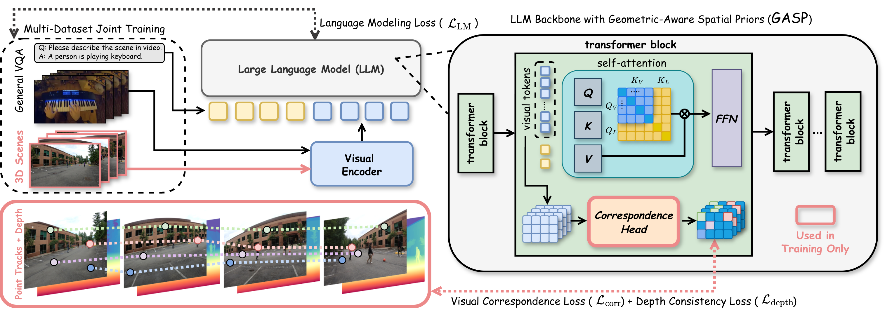
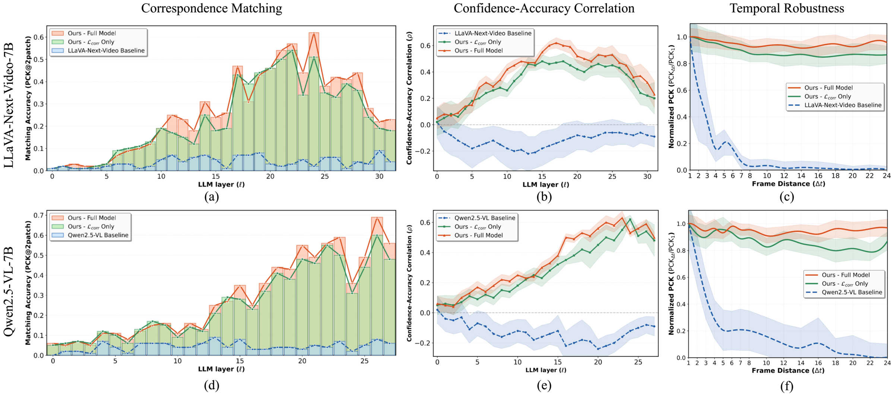
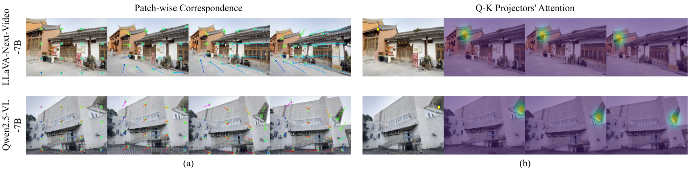

# GASP: Geometric-Aware Spatial Priors for VLMs

### Beyond 3D VQAs: Injecting 3D Spatial Priors into Vision-Language Models for Enhanced Geometric Reasoning

[Chun-Hsiao Yeh](https://danielchyeh.github.io/)<sup>1,2</sup>, [Shengyi Qian](https://jasonqsy.github.io/)<sup>1</sup>, [Manchen Wang](https://scholar.google.com/citations?user=VBatCtIAAAAJ&hl=en)<sup>1</sup>, [Yi Ma](https://people.eecs.berkeley.edu/~yima/)<sup>2,3</sup>, [Joseph Tighe](https://jovapo.github.io/)<sup>1</sup>, [Fanyi Xiao](https://fanyix.cs.ucdavis.edu/)<sup>1</sup>

<sup>1</sup>FAIR at Meta &nbsp; <sup>2</sup>UC Berkeley &nbsp; <sup>3</sup>HKU

**CVPR 2026 (Main Track)** &nbsp;

|&nbsp; [**Project Page**](https://danielchyeh.github.io/GASP/) &nbsp;|&nbsp; Paper (coming soon) &nbsp;|&nbsp; arXiv (coming soon)

---

<p align="center">
  
</p>

## TL;DR

GASP teaches VLMs fundamental geometry through point correspondence and depth consistency supervision at every transformer layer. The training head is discarded at inference, so there is zero overhead, and no 3D VQA data is required.

## Key Results

- Internal layer-wise correspondence: below 5% → over **70%**
- **+18.2%** on All-Angles Bench, **+29.0%** on VSI-Bench, **+15.0%** on BLINK Multi-View
- Zero inference overhead

## Method

<p align="center">
  
</p>

GASP attaches a lightweight **correspondence head** to every LLM transformer layer. The head is initialized via SVD decomposition of the pretrained query projection weights. During training, it receives a dual geometric supervision signal:

1. **Contrastive Correspondence Loss.** An InfoNCE loss on ground-truth point correspondences from large-scale video scenes (DL3DV) enforces 2D view-invariance across frames.
2. **Depth Consistency Loss.** A soft-argmax depth prediction using the correspondence distribution acts as a discriminative geometric regularizer, forcing the model to distinguish visually similar objects at different depths.

At inference, the correspondence head is discarded. The geometric priors are permanently embedded in the LLM's learned attention weights, enabling robust spatial reasoning without auxiliary inputs or additional parameters.

## Correspondence Analysis

<p align="center">
  
</p>

PCK, confidence-accuracy correlation, and temporal robustness across all transformer layers. GASP exceeds 70% peak PCK while baselines stay below 5%.

## Visual Correspondence

<p align="center">
  
</p>

(a) Patch-wise correspondence with optical flow encoding. (b) Attention heatmap for a query point.

## Code Release

Coming soon. Please **star** or **watch** this repo to get notified.

## Citation

```bibtex
@inproceedings{yeh2026gasp,
  title     = {Beyond 3D VQAs: Injecting 3D Spatial Priors into Vision-Language Models for Enhanced Geometric Reasoning},
  author    = {Yeh, Chun-Hsiao and Qian, Shengyi and Wang, Manchen and Ma, Yi and Tighe, Joseph and Xiao, Fanyi},
  booktitle = {IEEE/CVF Conference on Computer Vision and Pattern Recognition (CVPR)},
  year      = {2026}
}
```

## Acknowledgements

We thank the authors of [DL3DV](https://dl3dv-10k.github.io/DL3DV-10K/), [LLaVA-NeXT-Video](https://llava-vl.github.io/blog/2024-04-30-llava-next-video/), and [Qwen2.5-VL](https://github.com/QwenLM/Qwen2.5-VL) for their open-source datasets and models.

## Contact

For questions, please contact [Chun-Hsiao Yeh](https://danielchyeh.github.io/).
